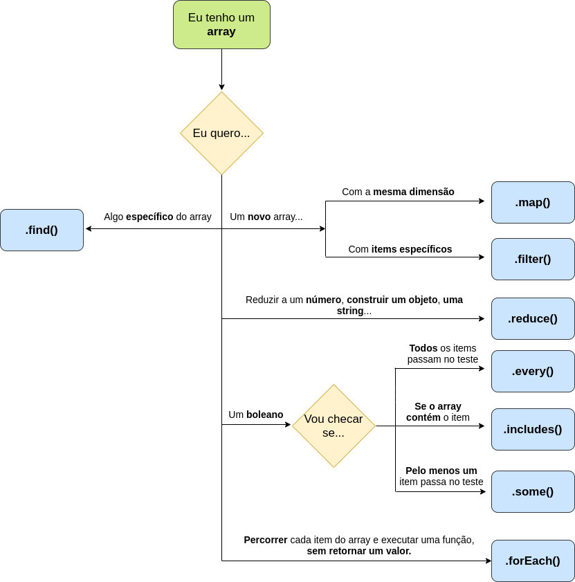

# *Higher order functions* - Map e Reduce

## O que vamos aprender?

Você foi contratado para trabalhar em uma das empresas parceiras da Trybe :sunglasses:. Sua tarefa é coletar os dados de entrada de um `<form>` fornecidos pelo usuário e enviá-los a uma API como um objeto. "Mapear", "iterar", "percorrer" dados te remetem a estruturas de repetições, como um loop `for` e `while`. Mas você logo percebe que essa não é a melhor alternativa para lidar com os dados de uma empresa com mais de 500.000 usuários :scream:!

Hoje vamos aprender duas _Higher Order Functions_ **muito** utilizadas por nós, desenvolvedores: o `Array.map` e o `Array.reduce`.

## Você será capaz de:

* Utilizar o `Array.map` para manipular e construir arrays;
* Utilizar o `Array.reduce` em tarefas como: somar elementos de um array, converter um array em um objeto, manipular e construir arrays;
* Criar códigos mais limpos, legíveis e de baixa complexidade combinando o `Array.map` e o `Array.reduce`.

## Porque isso é importante?

O exemplo introdutório nos mostra que, quando estamos trabalhando com dados numerosos, é muito importante escrever códigos expressivos, legíveis e que possam ser facilmente reimplementados. As HOF nos ajudam bastante nessa tarefa, e com o `Array.map` e o `Array.reduce` em mãos você poderá fazer muito mais!

## Conteúdo

### Tempo sugerido para estudo: 30 minutos

## Array.map

Como vimos anterirormente, _Higher Order Functions_ são funções que podem receber e/ou retornar outra função. Uma grande vantagem das HOFs é que elas podem ser reutilizadas. 

O método `map` é uma HOF e recebe uma única função como argumento. Antes de destrinchá-lo com exemplos, vamos nos atentar ao que o `map` recebe/retorna:

1.  O método `Array.map` **recebe uma única função** como parâmetro, que chamaremos de **callback**. Essa função será executada uma vez para cada elemento do array original; 
2.  O `Array.map` é executado em um array, e retornará um **novo array** com a **mesma quantidade de elementos** do **array original**.

Mas e a função callback, quais parâmetros ela recebe? A callback recebe três parâmetros, como pode ser visto a seguir:

```javascript
const newArray = arr.map(function callback(currentValue, index, array){
  // Code to do something;
});
```

1.  O parâmetro _currentValue_ corresponde ao elemento do array original em que a função está sendo aplicada;
2. _index_ é a posição desse mesmo elemento. Esse parâmetro é opcional;
3. _array_ corresponde ao array original em que a função é aplicada. Esse argumento também é opcional.

Em outras palavras, o método `map` irá executar a função callback uma vez para cada elemento (_currentValue_) do array que lhe foi passado (no exemplo, _arr_). O retorno da callback será um novo elemento que será inserido na mesma posição do elemento em que a função é executada. Ao fim da última iteração, teremos um novo array (_newArray_) com o retorno da função callback!

Observe que **utilizamos o map** quando queremos **transformar** um array a partir de um outro array, mas **mantendo a mesma quantidade de elementos do original**.  

Vamos ver na prática como isso funciona.

Como você faria para multiplicar por dois cada elemento do array abaixo, retornando o resultado em um novo array? Primeiro, tente fazer essa operação com um `for` antes de prosseguir.

```javascript
const oddNumbers = [2, 4, 6, 8, 10];
```

Sua solução deve estar parecida com essa daqui:

```javascript
const multiplesTwo = [];
for (let index = 0; index < oddNumbers.length; index += 1) {
  multiplesTwo.push(oddNumbers[index] * 2);
}

console.log(multiplesTwo); // [ 4, 8, 12, 16, 20 ]
```

Veja abaixo como seria a solução com o `map`:

```javascript
const multiplesTwoMap = oddNumbers.map(item => item * 2);

console.log(multiplesTwoMap); // [ 4, 8, 12, 16, 20 ]
console.log(oddNumbers); // [2, 4, 6, 8, 10]
```

Você consegue perceber que utilizando o `map` chegamos ao mesmo resultado com menos declarações, de uma forma muito mais direta? A grande vantagem do `map` é pegar uma função trivial, como uma simples multiplicação, e transformá-la em uma super-função muito mais eficiente, que será executada em todo o array com apenas uma chamada. Por fim, o map retornará um novo array com o resultado da multiplicação aplicado a cada item sem alterar o array oddNumbers. 

Veja como o map é capaz de tornar até códigos simples em um código muito mais legível, direto e fácil de ser reutilizado - afinal, você não precisaria de recriar o map caso quisesse realizar essa multiplicação novamente em um outro array, como aconteceria com o loop `for`.

Outra grande vantagem do método map é que você pode criar regras de negócio para serem aplicadas a elementos específicos do array de origem. Como você faria para converter as strings de um array em números, para que todos os elementos do novo array sejam números? Considere o array worldCupTitles abaixo e tente fazer esse exercício utilizando o `map` e o `for`!

```javascript
const worldCupTitles = [1958, '1962', '1970', '1994', 2002];
```

Com o for, uma solução seria: 

```javascript
const numbers = [];

for (let index = 0; index < worldCupTitles.length; index += 1) {
  if (typeof worldCupTitles[index] === 'string') {
    const convertToNumbers = parseInt(worldCupTitles[index]);
    numbers.push(convertToNumbers);
  } else {
    numbers.push(worldCupTitles[index]);
  }
}

console.log(numbers); // [ 1958, 1962, 1970, 1994, 2002 ]
```

Já com o map, teríamos:

```javascript
const onlyNumbers = worldCupTitles.map((year) => {
  if (typeof year === 'string') {
    return parseInt(year);
  }
  return year
});

console.log(onlyNumbers); // [ 1958, 1962, 1970, 1994, 2002 ]
```

Observe que queremos apenas transformar as strings do array worldCupTitles para que o novo array contenha apenas números, sem necessariamente modificar o array original. Nesse exemplo, usamos condicionais para checar se o tipo do elemento que está sendo iterado é uma string para, caso positivo, convertê-lo em um número utilizando a função [parseInt()](https://www.w3schools.com/jsref/jsref_parseint.asp).

Você pode aplicar mais de uma regra de negócio dentro de um `map`. Mas contrua a callback pensando em **como é o elemento que ela irá receber como parâmetro**, e **como você quer que ele seja ao final da operação**. O map irá aplicar essa função callback em cada item do array, retornando um novo array com as transformações passadas.

Por fim, vamos ver um exemplo onde o map foi utilizado para manipular um objeto em um array. O `Array.map` pode ser usado para iterar objetos assim como fazemos com arrays. Podemos construir uma callback que modifique o conteúdo de cada objeto e retorne um novo array contendo o objeto modificado. Que tal praticarmos um pouco a manipulação de um objeto utilizando o `map`? Considere o array shopCart a seguir. Tente modificá-lo de forma que exista apenas dois pares chave-valor. A primeira chave refere-se ao nome do produto, e recebe a quantidade comprada. A segunda chave será o valor da compra parcial, ou seja, _quantidade x preço_.

```javascript
const shopCart = [
  {
    product: 'Pants',
    quantity: 2,
    price: 17.99
  },
  {
    product: 'Dress',
    quantity: 4,
    price: 35.99,
  },
  {
    product: 'Shoes',
    quantity: 3,
    price: 30.99
  }
]
```

Resolução:

```javascript
const shopCartByItem = shopCart.map((item) => {
  const newObject = {};

  newObject[item.product] = item.quantity;
  newObject.partialPrice = item.quantity * item.price;

  return newObject;
});

console.log(shopCartByItem);

// Resultado esperado:

[
  { Pants: 2, partialPrice: 35.98 },
  { Dress: 4, partialPrice: 143.96 },
  { Shoes: 3, partialPrice: 92.97 }
]
```
Nesse exemplo, a função callback cria um novo objeto e atribui a ele as modificações necessárias usando notações de objeto. O retorno da callback é justamente esse novo objeto, que é retornado dentro do array shopCartByItem. Observe que tanto o array original (shopCart) quanto o novo array (shopCartByItem) possuem a mesma quantidade de elementos. O map será muito utilizado durante a sua carreira como desenvolvedor para processar e condensar dados antes de repassá-los para alguma outra aplicação (como uma API).

## Array.reduce

Antes de entendermos o método `Array.reduce` observe atentamente a sua sintaxe abaixo:

```javascript
  const result = arr.reduce(function callback(accumulator, currentValue) {
    // Code to do something;
    return resultAccumulator
  }, initialValue);
```

Assim como o `Array.map`, o método `Array.reduce` também é uma HOF que recebe como parâmetro uma única função que será executada para cada item de um array. No entanto, esse método tem uma assinatura  bem diferente do `map` e de outras HOF. Alguns pontos de atenção:

* O retorno do `reduce` **não é necessariamente um array**. Como será visto em breve, o reduce retornará o valor do parâmetro _accumulator_ depois de todas as iterações. Por enquanto, tenha em mente que o _accumulator_  e o retorno do `reduce` podem ser um número, uma string, um array ou até mesmo um objeto. Você verá em breve que essa característica é uma das responsáveis por fazer este método tão versátil! 
* A função callback que passamos para o `reduce` recebe dois parâmetros obrigatórios (_accumulator_ e _currentValue_);
* O método `Array.reduce` pode receber um segundo parâmetro opcional: _initialValue_.

Com essas diferenças em mente, assim como fizemos com o `map`, vamos nos perguntar: o que é passado para o `Array.reduce`, e o que ele irá nos retornar?

Vamos destrinchar a função callback que o `reduce` recebe como parâmetro. Neste ponto, você já sabe que:

* Esta função será executada para cada elemento do array passado para o `reduce`;
* A callback tem dois parâmetros obrigatórios.

Como a função callback tem uma assinatura diferente das funções passadas para as demais HOF, vamos chamá-la aqui de reducer para melhor ilustrar o que essa função faz:

```javascript
function reducer(accumulator, currentValue, index, array) {
  //  Code to do something;
  return resultAccumulator
}
```

Além dos dois parâmetros obrigatórios, a função reducer também recebe dois parâmetros opcionais (_index_ e _array_).

1. O parâmetro _accumulator_ é uma variável que salvará o resultado de cada iteração. Ele **acumula** o resultado após a função ser executada para o elemento que está sendo iterado. Quando a última iteração for concluída, o _accumulator_ terá acumulado o resultado de cada iteração;
2. _CurrentValue_ é o elemento do array passado ao `Array.reduce` no qual a função reducer está sendo executada;
3. O _index_ corresponde à posição do elemento do array original no momento em que a função é executada. Ou seja, a posição do _currentValue_;
4. O array corresponde ao array original passado ao `Array.reduce`. A função reducer será aplicada para cada elemento desse array.

Vamos entender o método `reduce` com um exemplo prático. considere o array numbers abaixo. Como você faria para somar todos os items do array? Tente fazer esse exercício antes de prosseguir.

```javascript
const numbers = [1, 5, 8, 54, 20];
```

Utilizando o `for`, calculamos a soma dos números do array numbers como sendo:

```javascript
let resultSum = 0; // Variável para armazenar o valor da soma.
for (let index = 0; index < numbers.length; index += 1) {
  resultSum += numbers[index]; // A cada iteração, o resultado da soma é "acumulado" e atribuído a resultSum. 
}

console.log(resultSum); // 88
```

Utilizando o `reduce`:

```javascript
const getSum = (result, number) => result + number; // 'getSum' é a função callback que passamos para o reduce. 'result' é o accumulator, e armazenará o resultado da soma a cada iteração.
const resultSum = numbers.reduce(getSum);

console.log(resultSum); // 88

//  Refatorando a função acima:

const resultSum = numbers.reduce((result, number) => result + number);

console.log(resultSum); // 88
```

A tabela abaixo representa o que acontece com cada parâmetro da callback quando ela é executada. Observe que essa função será chamada **quatro vezes** e que o acumulador "carrega" o resultado da última iteração.

Chamada | result (accumulator) | number (currentValue) | index (opcional) | Retorno
------------ | ------------- | ------------- | ------------- | -------------
Primeira chamada | 1 | 5 | 1 | 6
Segunda chamada | 6 | 8 | 2 | 14
Terceira chamada | 14 | 54 | 3 | 68
Quarta chamada | 68 | 20 | 4 | 88

Você consegue perceber as diferenças entre a solução com o `for` e `reduce`? Tente listá-las antes de prosseguir para fixar o conteúdo!

Outra vantagem do `reduce` é atribuir um valor ao acumulador antes de executar a função callback. Assim, na primeira iteração o acumulador terá o valor especificado no parâmetro _initialValue_. Quando não passamos um valor inicial, o acumulador assume o valor do elemento na posição 0 do array que será processado. 

Rode o código abaixo no seu editor e veja o que acontece!

```javascript
const resultSum = numbers.reduce((result, number) => result + number, 10);

console.log(resultSum); // 98
```

Assim como outras HOF, você também pode aplicar regras de negócio para que a função callback processe items específicos do array passado ao `reduce`. Como você faria para somar **apenas** os números pares do array numbers? Novamente, tente fazer esse exercício utilizando o `reduce` antes de seguir com a matéria.

```javascript
const sumOddNumbers = numbers.reduce((result, number) => {
  if (number % 2 === 0) {
    return result + number;
  }
  return result;
}, 0);

console.log(sumOddNumbers); // 82
```

Observe que nesse exemplo, precisamos passar o valor 0 como parâmetro para o `reduce`. Lembre-se de que quando esse parâmetro **não** é passado, o acumulador assumirá o valor do item na posição zero para a primeira chamada da função. No exemplo, temos o número 1 no índice 0 e ele não deve ser somado!

Comparando o `map` e o `reduce`, note que enquanto o método `Array.map` **transforma** um array em um novo array com as mesmas dimensões, neste exemplo o método `Array.reduce` **reduziu** o array passado a um único valor. Mas **atenção**: como explicamos no início dessa sessão o `reduce` não irá necessariamente reduzir uma estrutura de array a um único número. Exemplos numéricos são ótimos para enxergar com clareza como o método `reduce` funciona. Mas podemos ir ~~ao infinito e~~ além com o `reduce` adicionando regras de negócio, manipulando arrays e  construindo objetos, como veremos nos exemplos práticos a seguir.

Vamos voltar ao exemplo do carrinho de compras para exemplificar o uso do `reduce` em outros contextos, como para construir um novo objeto a partir de um array. O seu objetivo aqui é criar um objeto com a chave totalQuantity contendo a quantidade total comprada, e a chave totalPrice com o valor total da compra. Utilize o array shopCartByItem abaixo: 

```javascript
const shopCartByItem = [
  { product: 'T-shirt', price: 35.90 },
  { product: 'Sneakers', price: 145.50 },
  { product: 'Jeans', price: 92.50 },
]
```
Resolução: 
```javascript
const newObject = {
  totalQuantity: 0,
  totalPrice: 0,
}

const summaryResult = shopCartByItem.reduce((accumulator, item) => {
  accumulator.totalQuantity += 1;
  accumulator.totalPrice += item.price;
  return accumulator;
}, newObject);

console.log(summaryResult); // { totalQuantity: 3, totalPrice: 273.9 }
```

A partir de um array contendo três objetos, construímos um único objeto com uma nova estrutura. Perceba que nesse exemplo o acumulador **não é um número**. Note também que os parâmetros que passamos para a callback (accumulator e item) **não são do mesmo tipo**. Antes de começar a resolver qualquer problema com o `reduce`, pense no que você está passando para a callback e como essa função irá processá-los. Outro ponto de atenção aqui é o retorno da callback. Observe que o acumulador que retornamos contém as modificações implementadas por essa função. O que aconteceria se você esquecesse o retorno da callback? Faça esse teste no seu editor antes de prosseguir!

Antes de praticar o que aprendemos com os exercícios, vamos recaptular o que vimos com o diagrama abaixo. Além do `map` e `reduce`, o diagrama também inclui outros métodos que são muito utilizados - como o `forEach`, `find`, `filter`, `some`, `every` e o `includes`. Se você ainda não está familiarizado com todas eles, não se preocupe! Tente abstrair o que queremos retornar com cada método, e procure pesquisar aqueles que você ainda não conhece.



## Exercícios

### Tempo sugerido para realizar os exercícios: 60 minutos.

Leia atentamente o enunciado de cada exercício e faça o que se pede! Não se esqueça de versionar o seu código no seu repositório com arquivos e `commits` específicos para cada exercício, hein?! :eyes:

Considere o array com os grandes sucessos da música britânica abaixo. Você irá utilizá-lo para resolver os exercícios 1 e 2. 

```javascript
const topBritishBands = [
  {
    name: 'The Beatles',
    bestAlbuns: [
      { album: 'Sgt. Pepper Lonely Hearts Club Band' , sales: 32000000},
      { album: 'Revolver', sales: 27000000},
      { album: 'Rubber Soul', sales: 16500000},
      { album: 'The Beatles', sales: 16000000}
    ],
    genre: 'Pop'
  },
  {
    name: 'Elton John',
    bestAlbuns: [
      { album: 'One Night Only -- The Greatest Hits', sales: 12000000},
      { album: 'Duets', sales: 8000000},
      { album: 'The Big Picture', sales: 7500000},
      { album: 'Songs from the West Coast', sales: 5000000},
    ],
    genre: 'Pop',
  },
  {
    name: 'Led Zeppelin',
    bestAlbuns: [
      { album: 'Led Zeppelin IV', sales: 23000000},
      { album: 'Physical Graffiti', sales: 16000000},
      { album: 'Led Zeppelin II', sales: 12000000},
      { album: 'Houses of the Holy', sales: 4000000},
    ],
    genre: 'Heavy metal',
  },
  {
    name: 'Queen',
    bestAlbuns: [
      { album:  'A Night at the Opera', sales: 6000000},
      { album: 'Sheer Heart Attack', sales: 3000000},
      { album: 'Jazz', sales: 5000000},
      { album: 'The Game', sales: 2500000}
    ],
    genre: 'Hard rock'
  },
  {
    name: 'Pink Floyd',
    bestAlbuns: [
      { album: 'The Dark Side of the Moon', sales: 9500000},
      { album: 'Animals', sales: 7000000},
      { album: 'Wish You Were Here', sales: 6500000},
      { album: 'Meddle', sales: 2000000},
    ],
    genre: 'Progressive rock'
  },
]
```

1. Crie um array que contenha as cinco melhores bandas inglesas e os seus respectivos gêneros no formato BANDA - GÊNERO. *Dica: você pode usar o map para esta operação.*

2. Crie uma função que retorne um array que mostre o nome do álbum mais vendido por cada banda. *Dica: você pode usar o map combinado com o reduce para esse exercício.*

Considere o array menu para fazer os exercícios 3 e 4. Ele contém o menu de um restaurante japonês com os itens disponíveis, o preço e a quantidade da porção que vem em cada item.

```javascript
const menu = [
  { type: 'entrada', name: 'Shimeji na manteiga', price: 18.90,  quantity: 1 },
  { type: 'Prato', name: 'sushis', price: 9.50, quantity: 14 },
  { type: 'Prato', name: 'sashimi', price: 32.90, quantity: 10 },
  { type: 'Prato', name: 'hossomakis variados', price: 24.90, quantity: 6 },
  { type: 'Prato', name: 'uramakis', price: 30.90, quantity: 8 },
  { type: 'Sobremesa', name: 'banana caramelada', price: 11.90, quantity: 6 },
]
```

3. Um cliente faminto pediu o combo da casa, que contém todos os items disponíveis no menu. Calcule o valor da conta final, considerando que o restaurante cobra uma taxa de serviço de 15%. 

4. Crie um objeto para o cliente faminto contendo o nome de todos os items consumidos em ordem alfabética e a quantidade de comida que ele ingeriu (isto é, leve em consideração a quantidade que vem em cada porção)

5. Um grupo de amigos fez o seguinte pedido:

```javascript
order = {
  'shimeji na manteiga': 4,
  'hossomakis variados': 3,
  'sushis': 5,
  'sashimi': 3,
  'banana caramelada': 2,
}
```

Retorne o preço total a ser cobrado considerando a quantidade pedida pelo grupo, e a taxa de serviço de 15%.

## Bonus

Para os exercícios bônus, considere o array countries abaixo. Ele contém uma lista com informações referente aos países fundadores do Mercosul.

```javascript
const countries = [
  {
    name: 'Brazil',
    currency: 'Brazilian real',
    languages: 'Portuguese',
    leaders: [
      {
        firstName: 'Fernando Henrique',
        lastName: 'Cardoso',
        birthYear: 1931,
        year: 1998,
      },
      {
        firstName: 'Luiz Inacio',
        lastName: 'Lula da Silva',
        birthYear: 1945,
        year: [2002, 2006],
      },
      {
        firstName: 'Dilma',
        lastName: 'Rousseff',
        birthYear: 1947,
        year: [2010, 2014],
      },
      {
        firstName: 'Michel',
        lastName: 'Temer',
        birthYear: 1940,
        year: 2014,
      },
      {
        firstName: 'Jair',
        lastName: 'Bolsonaro',
        birthYear: 1955,
        year: 2018,
      },
    ]
  },
  {
    name: 'Argentina',
    currency: 'Argentine peso',
    languages: ['Spanish', 'English', 'Italian', 'German', 'French'],
    leaders: [
      {
        firstName: 'Fernando',
        lastName: 'de la Rua',
        birthYear: 1937,
        year: 1999,
      },
      {
        firstName: 'Adolfo',
        lastName: 'Rodríguez Saá',
        birthYear: 1947,
        year: 2001,
      },
      {
        firstName: 'Eduardo',
        lastName: 'Duhalde',
        birthYear: 1941,
        year: 2002,
      },
      {
        firstName: 'Nestor',
        lastName: 'Kirchner',
        birthYear: 1950,
        year: 2003,
      },
      {
        firstName: 'Cristina',
        lastName: 'Fernández de Kirchner',
        birthYear: 1953,
        year: [2007, 2011],
      },
      {
        firstName: 'Mauricio',
        lastName: 'Macri',
        birthYear: 1959,
        year: 2015,
      },
      {
        firstName: 'Alberto',
        lastName: 'Fernandez',
        birthYear: 1959,
        year: 2019,
      },
    ]
  },
  {
    name: 'Venezuela',
    currency: 'Venezuelan bolívar',
    languages: 'Spanish',
    leaders: [
      {
        firstName: 'Hugo',
        lastName: 'Chavez',
        birthYear: 1954,
        year: [2001, 2002, 2007, 2013]
      },
      {
        firstName: 'Pedro',
        lastName: 'Carmona Estanga',
        birthYear: 1941,
        year: 2002,
      },
      {
        firstName: 'Diosdado',
        lastName: 'Cabello',
        birthYear: 1963,
        year: 2002,
      },
      {
        firstName: 'Nicolas',
        lastName: 'Maduro',
        birthYear: 1962,
        year: 2013,
      },
    ]
  },
  {
    name: 'Paraguay',
    currency: 'Paraguayan guaraní',
    languages: ['Spanish', 'Guaraní'],
    leaders: [
      {
        firstName: 'Luis',
        lastName: 'Ángel González Macchi',
        birthYear: 1947,
        year: 1999,
      },
      {
        firstName: 'Nicanor',
        lastName: 'Duarte Frutos',
        birthYear: 1956,
        year: 2003,
      },
      {
        firstName: 'Fernando',
        lastName: 'Lugo',
        birthYear: 1951,
        year: 2008,
      },
      {
        firstName: 'Federico',
        lastName: 'Franco',
        birthYear: 1962,
        year: 2012,
      },
      {
        firstName: 'Horacio',
        lastName: 'Cartes',
        birthYear: 1956,
        year: 2013,
      },
      {
        firstName: 'Mario',
        lastName: 'Abdo Benítez',
        birthYear: 1971,
        year: 2018,
      },
    ]
  },
  {
    name: 'Uruguay',
    currency: '	Uruguayan peso',
    languages: 'Spanish',
    leaders: [
      {
        firstName: 'Julio',
        lastName: 'María Sanguinetti',
        birthYear: 1936,
        year: 2000,
      },
      {
        firstName: 'Jorge',
        lastName: 'Batlle',
        birthYear: 1927,
        year: 2005,
      },
      {
        firstName: 'Tabaré',
        lastName: 'Vázquez',
        birthYear: 1940,
        year: 2010,
      },
      {
        firstName: 'José',
        lastName: 'Mujica',
        birthYear: 1935,
        year: 2015,
      },
      {
        firstName: 'Lacalle',
        lastName: 'Pou',
        birthYear: 1973,
        year: 2020,
      },
    ]
  },
]
```
1. Crie um array que imprima para cada país fundador a seguinte frase frase: "NOME_DO_PAÍS teve NÚMERO_LÍDERES_POLÍTICOS no século XX".

2. Calcule a idade média dos presidentes atuais quando eles tomaram posse.

## Recursos adicionais

- [Javascript Higher Order Functions: Map e Reduce do zero ao topo.](https://medium.com/@fabiosenracorrea/javascript-higher-order-functions-map-e-reduce-do-zero-ao-topo-6365784f959a)
- [Functional javascript: how to use array reduce for more than just numbers](https://jrsinclair.com/articles/2019/functional-js-do-more-with-reduce/)